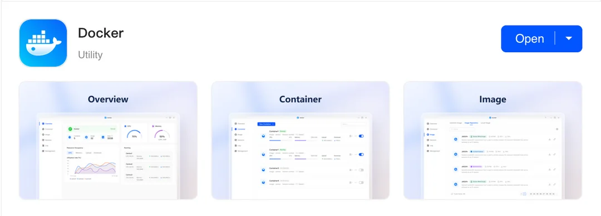

# Unblock ports 80 and 443 to run any (docker) service you want

**TL;DR**: To use port 80/443, you need to change the default configs in `/etc/nginx/ugreen_redirect.conf` and `/etc/nginx/ugreen_ssl_redirect.conf`. As it is overwritten by the UGOS software, you need to setup a service that constantly watches for changes. Additionaly, [traefik](https://doc.traefik.io/traefik/) is used as reverse proxy and reloaded automatically. 

## Instructions

### 1. Go to the app center and download Docker



### 2. Make sure that SSH is enabled and login to your NAS


### 3. Connect to your NAS (where USERNAME is your account name and IP is the ip of your NAS).

```sh
$ ssh USERNAME@IP
```

When asked for a password, use your account password.

### 4. Setup a service to change the nginx port.

Depending on your service, you need a specific port to connect to it. I wanted to use traefik as a reverse proxy, so I ran into the issue that the ports 80 and 443 were already in use by nginx that ships with UGOS. For example you can see it for port 80 here:

```sh
User@DXP4800PLUS:~$ sudo netstat -ltnp | grep -w ':80'
tcp6       0      0 :::80      :::*     LISTEN      34106/nginx: master 
```

To change that, we need to modify the nginx config inside `/etc/nginx/ugreen_redirect.conf` and `/etc/nginx/ugreen_ssl_redirect.conf`. However, on each settings change from the UGOS web interface or system reboot, that file is overwritten. To fix that, we need to setup a system service (crontab is no option here as it gets overwritten as well by the system).

Create the file /usr/local/bin/update_nginx_listen.sh

```sh
$ sudo nano /usr/local/bin/update_nginx_listen.sh
```

and paste the content of [usr/local/bin/update_nginx_listen.sh](usr/local/bin/update_nginx_listen.sh) inside.

Next, create a file for the service definition like `/etc/systemd/system/nginx-listen-monitor.service`

```sh
$ sudo nano /etc/systemd/system/nginx-listen-monitor.service
```

and paste the content of [etc/systemd/system/nginx-listen-monitor.service](etc/systemd/system/nginx-listen-monitor.service) inside.

Repeat these steps for the ssl config files.

Create the file `/usr/local/bin/update_nginx_listen_secure.sh`

```sh
$ sudo nano /usr/local/bin/update_nginx_listen_secure.sh
```

and paste the content of [usr/local/bin/update_nginx_listen_secure.sh](usr/local/bin/update_nginx_listen_secure.sh) inside.

Next, create a file for the service definition like `/etc/systemd/system/nginx-listen-monitor.service`

```sh
$ sudo nano /etc/systemd/system/nginx-listen-secure-monitor.service
```

and paste the content of [etc/systemd/system/nginx-listen-secure-monitor.service](etc/systemd/system/nginx-listen-secure-monitor.service) inside.

Next, you need to make the scripts executable:

```sh
$ sudo chmod +x /usr/local/bin/update_nginx_listen.sh
$ sudo chmod +x /usr/local/bin/update_nginx_listen_secure.sh
```

Reload the systemctl deamon:

```sh
$ sudo systemctl daemon-reload
```

Enable and start the services:

```sh
$ sudo systemctl enable nginx-listen-monitor.service
$ sudo systemctl start nginx-listen-monitor.service
$ sudo systemctl enable nginx-listen-secure-monitor.service
$ sudo systemctl start nginx-listen-secure-monitor.service
```

You can always get the current status (or find information to debug errors) with:

```sh
$ sudo systemctl status nginx-listen-monitor.service
$ sudo systemctl status nginx-listen-secure-monitor.service
```

A quick check shows that the ports 80 and 443 are no longer used by nginx.

```sh
User@DXP4800PLUS:~$ sudo netstat -ltnp | grep -w ':80'
User@DXP4800PLUS:~$ sudo netstat -ltnp | grep -w ':443'
```

### 5. (Optional) Add your docker compose service.

Create and navigate to the directory `/volume1/docker_compose/` and create a directory for your service (I would not recommend to use the already created docker directory as the permissions inside that are overwritten by the system). Place your `docker-compose.yml` file inside that directory. You can also use VS Code for example to start a [remote SSH session](https://code.visualstudio.com/docs/remote/ssh) which makes file handling a lot easier.

```sh
$ mkdir /volume1/docker_compose/
$ cd /volume1/docker_compose/
$ mkdir your_service
$ cd your_service
$ nano docker-compose.yml
```

And after you put in your config, start the service.

```sh
$ sudo docker compose up
```

### 6. Profit.

Now you can use your NAS just like any other server.

**Bonus**

You can also modify your files from the File Manager app.


And you can control the services from the Docker app.


